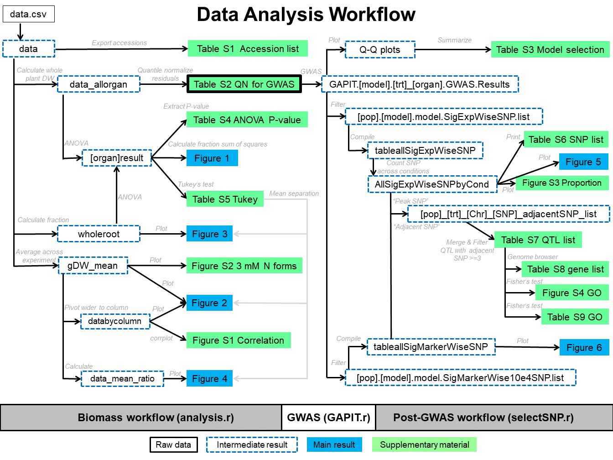

# Analysis workflow and R codes for "Genome-Wide Association Study of Rice (*Oryza sativa* L.) Early Biomass Production under Different Inorganic Nitrogen Forms — Ammonium or Nitrate"
---
## Dataset
Kasemsap, Pornpipat; Cohen, Itay; Bloom, Arnold J. (2023), Early Biomass Production under Different Inorganic Nitrogen Forms of the USDA Rice (*Oryza sativa* L.) Diversity Panel 1, Dryad, Dataset, https://doi.org/10.25338/B8JP8C
## Publication
Submitted. This section will be updated once the final manuscript is available following the peer-review process.
## Workflow
The following diagram illustrates two major workflows employed in "Genome-Wide Association Study of Rice (*Oryza sativa* L.) Early Biomass Production under Different Inorganic Nitrogen Forms — Ammonium or Nitrate": 1) **Biomass workflow** ```analysis.r``` and 2) **Post-GWAS workflow** ```selectSNP.r```. The two work workflows are connected by the Genome-Wide Association Study (**GWAS**) ```GAPIT.r```. Text box colors and styles denote file types in the analysis workflow as followed: White box with solid lines (data), white box with dashed blue lines (intermediate result), blue box (main result included in the manuscript), green box (supplementary material).

## Corresponding author
Pornpipat Kasemsap, pkasemsap [at] ucdavis.edu
