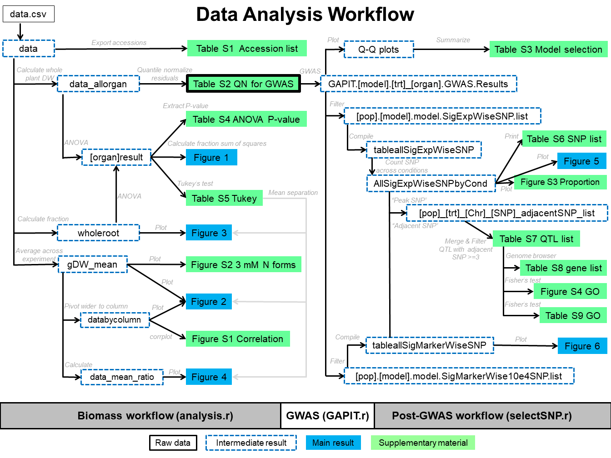

# Analysis workflow and R codes for "Genome-wide association study of rice vegetative growth under ammonium or nitrate nutrition"
---
## Dataset
Kasemsap, P., Cohen, I., & Bloom, A. J. (2025), Vegetative biomass production under different inorganic nitrogen forms of the USDA rice (Oryza sativa L.) diversity panel 1, Dryad, Dataset, https://doi.org/10.25338/B8JP8C
## Publication
Kasemsap, P., Cohen, I., & Bloom, A. J. (2025). Genome-wide association study of rice vegetative growth under ammonium or nitrate nutrition. *Plant Physiology and Biochemistry*, 110281. [https://doi.org/10.1016/j.plaphy.2025.110281](https://doi.org/10.1016/j.plaphy.2025.110281) 
## Workflow
The following diagram illustrates two major workflows employed in "Genome-Wide Association Study of Rice (*Oryza sativa* L.) Early Biomass Production under Different Inorganic Nitrogen Forms — Ammonium or Nitrate": 1) **Biomass workflow** ```analysis.r``` and 2) **Post-GWAS workflow** ```selectSNP.r```. The two work workflows are connected by the Genome-Wide Association Study (**GWAS**) ```GAPIT.r```. Text box colors and styles denote file types in the analysis workflow as followed: White box with solid lines (data), white box with dashed blue lines (intermediate result), blue box (main result included in the manuscript), green box (supplementary material). We include R version information, the OS and attached or loaded packages used in each analysis workflow for the data presented in the submitted manuscript as "sessionInfo_[workflow].text".

## Corresponding author
Pornpipat Kasemsap, paulkasemsap [at] gmail.com
